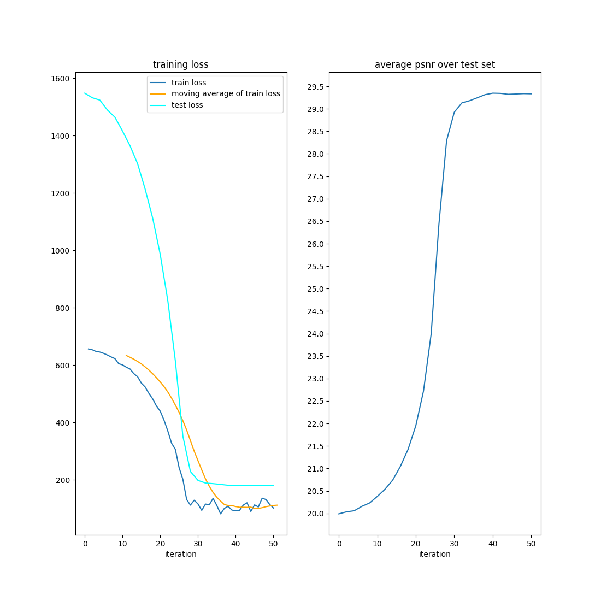

# BilevelOptimisation

StochasticBilevelOptimisation is PyTorch-based library for learning hyperparameters 
$\theta$ by means of solving the bilevel problem

$$(P_{bilevel}) ~~~~~\inf_{\theta} F(u^{*}(\theta), u^{(0)}) ~~~ \text{s.t.}  
    ~~~ u^{*}(\theta)\in\operatorname{arginf}_{u}E(u, u^{(\delta)}, \theta)$$

where $F$ refers to the outer loss function which quantifies the goodness of the 
learned $\theta$ w.r.t. groundtruth data $u^{(0)}$. $E$ denotes the inner cost or 
energy function, which is used to reconstruct clean data $u^{(0)}$ from noisy 
observations $u^{(\delta)}$. We assume that $E$ is of the form

$$E(u, u^{(\delta)}, \theta) = 
    \frac{1}{2\sigma^{2}}\|u - u^{(\delta)}\|_{2}^{2} + \lambda R(u, \theta)$$

where $\sigma$ indicates the noise level, $R$ refers to a regulariser 
(FoE model, ...) and $\lambda>0$ denotes a regularisation parameter.

## Table of contents

- [Features](#features)
- [Installation](#installation)
- [Usage](#usage)
- [Support](#support)
- [Contributing](#contributing)
- [Citation](#citation)
- [References](#references)
- [Acknowledgements](#acknowledgements)
- [License](#license)
- [References](#references)

## Features

### Current features

- Gradient based solution of the $P_{bilevel}$ using implicit differentiation
- PyTorch conformity: 
- Modularity: The package is modulary by design. Its architecture allows easy    
    customization and extension. Each of the core components   
    - Measurement model
    - Inner energy
    - Regulariser
    - Outer loss
    - Optimiser
    is encapsulated in its own module or optimiser class. Thus, all of these 
    components can be exchanged easily without any need to modify  
    the core logic.
- Sample codes for denoising use cases

### Upcoming features

- Unrolling for solving inner problem
- Sampling based approach for solving inner problem

## Installation

- Through pip

    ```
    pip install ...
    ```

- From source

    ```
    git clone ...
    ```

## Usage

### Conceptual

```python
from torch.utils.data import DataLoader

from bilevel_optimisation.fields_of_experts.FieldsOfExperts import FieldsOfExperts
from bilevel_optimisation.bilevel.Bilevel import Bilevel
from bilevel_optimisation.losses.Losses import L2Loss
from bilevel_optimisation.dataset.ImageDataset import ImageDataset
from bilevel_optimisation.potential.Potential import Potential
from bilevel_optimisation.measurement_model.MeasurementModel import MeasurementModel
from bilevel_optimisation.energy.InnerEnergy import InnerEnergy

train_image_dataset = ImageDataset(train_data_root_dir)

potential = Potential()
regulariser = FieldsOfExperts(potential, filters_spec, filter_weights_spec)
bilevel = Bilevel(L2Loss(), optimiser_class(regulariser.parameters()), solver_factory)

while not training_finished:
  train_loader = DataLoader(train_image_dataset, batch_size=batch_size)
  for batch in train_loader:
    measurement_model = MeasurementModel(batch, forward_operator, noise_level)
    inner_energy = InnerEnergy(measurement_model, regulariser, lam, optimiser_factory)

    loss = bilevel(outer_loss, inner_energy)
```

### Concrete

Concrete and executable code for training and prediction is contained in `bilevel_optimisation/examples`. Please note
that reproducibility of training results can be obtained only when using the datatype `torch.float64`. However, 
this comes at the cost of increased computation time. 

#### Denoising using pretrained models

- **Example I**
  - Potential: Student-t 
  - Filters: Pretrained filters from [[1]](#1) 
  - Filter weights: Optimised using `StochasticBilevelOptimisation`.

  To run the script, first update the dataset configurations in `config_data/example_prediction_I`, 
  then execute 

    ```
    python examples/scripts/denoising_predict.py --configs example_prediction_I 
    ```
  
  Alternatively, run the Jupyter notebook `example_denoising_predict.ipynb`.

  |                    Test triplet                     |                     Filter response                     |
  |:---------------------------------------------------:|:-------------------------------------------------------:|
  |  |  |

- **Example II** ...
  
#### Training of FoE models

- **Example I**
  - Potential: Student-t
  - Filters: 
    - Pretrained filters from [[1]](#1)
    - Non-trainable
  - Filter weights:
    - Uniform initialisation
    - Trainable 
  - Optimiser:
    - Inner: AlternatingNAGOptimiser
    - Outer: NAGOptimiser
  
  To run the training script, execute   

    ```
    python examples/scripts/denoising_train.py --configs example_training_I 
    ```

  |                    Training stats                    |                Potential weight stats                |                    Test triplet                    |
  |:----------------------------------------------------:|:----------------------------------------------------:|:--------------------------------------------------:|
  |  |  |  |

  Note that already after very iterations, we obtain a notable denoising performance. The main 
  reason for this behaviour is the nearly optimal initialisation of the filters. 

- **Example II**
  - Potential: Student-t
  - Filters:
    - Pretrained filters from [[1]](#1)
    - Trainable
  - Filter weights:
    - Uniform initialisation
    - Trainable
  - Optimiser:
    - Inner: NAGOptimiser
    - Outer: NAGOptimiser
  
  To run the corresponding training script, execute  

  ```
  python examples/scripts/denoising_train.py --configs example_training_II
  ```

  The training results are consistent with the results obtained in Example I. Notably, although the filters 
  are trainable, their $l^{2}$-norm remains nearly constant throughout the training process:

  |                    Training stats                    |                    Filter stats                    |               Student-t potential                |
  |:----------------------------------------------------:|:--------------------------------------------------:|:------------------------------------------------:|
  |  |  |  |

- **Example III**
  - Potential: Student-t
  - Filters:
    - 7x7 DCT filters
    - Trainable
  - Filter weights:
    - Uniform initialisation
    - Trainable
 - Optimiser:
    - Inner: NAGOptimiser
    - Outer: Adam

  To train filters and filter weights with these specifications, call
  ```
  python examples/scripts/denoising_train.py --configs example_training_III
  ```

  We obtain similar denoising results as before:

  
  |                    Training stats                     |                    Filter stats                     |                 Potential weight stats                 |                Student-t potential                |
  |:-----------------------------------------------------:|:---------------------------------------------------:|:------------------------------------------------------:|:-------------------------------------------------:|
  |  |  |  |  |

- **Example IV** 
  - Potential: Student-t
  - Filters:
    - Uniform on [-1, 1]
    - Trainable
  - Filter weights:
    - Uniform initialisation
    - Trainable
 - Optimiser:
    - Inner: NAGOptimiser
    - Outer: Adam

  Results: ...

- **Example V**
  - Potential: Gaussian mixture
  - Filters:
    - Pretrained filters from [[1]](#1)
    - Non-trainable
  - Filter weights:
    - Pretrained filters using configuration in Example I
    - Non-trainable
 - Optimiser:
    - Inner: NAGOptimiser
    - Outer: Adam

  Results: ...

## Contributing

1. Fork the repository
2. Create a feature branch
3. Submit a pull request

## References

<a id="1">[1]</a> 
Chen, Y., Ranftl, R. and Pock, T., 2014. 
Insights into analysis operator learning: From patch-based sparse models to
higher order MRFs. 
IEEE Transactions on Image Processing, 23(3), pp.1060-1072.

## License

MIT License

